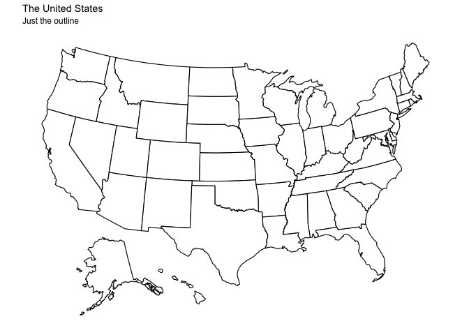

Create a heatmap of the USA
================

There are multiple methods of creating maps in R if you have longitude
and latitude coordinates or full state or country counts. This tutorial
will assume you have some familiarity to tidyverse and magrittr style R
programs. For a full discussion on the benefits of tidyverse-style R
programming, see [Wickham et
al, 2019](https://tidyverse.tidyverse.org/articles/paper.html)

## R Libraries required

You might need to install the packages if they are not already
installed.

``` r
install.packages(c("tidyverse", "magrittr", "ggmap", "RColorBrewer", "usmap"))
```

Then load the libraries into R.

``` r
library(tidyverse)
library(magrittr)
library(usmap)
#library(ggmap)         # <= requires a google key
#library(RColorBrewer)
#library(sf)            # <= eventually use sf methods
```

## Input File

We are going to assume you have a count of items by state. Please
download the input file from this [link](data/usa.xlsx).

``` r
# === Load the Excel Spreadsheet of state and counts
data <- readxl::read_excel("data/usa.xlsx")
head(data)
#> # A tibble: 6 x 3
#>   States     TwoLetters Count
#>   <chr>      <chr>      <dbl>
#> 1 Alabama    AL             1
#> 2 Alaska     AK             2
#> 3 Arizona    AZ             3
#> 4 Arkansas   AR             4
#> 5 California CA             5
#> 6 Colorado   CO             6
```

Now let’s combine that with states.

``` r

plot_usmap(include = c(data$TwoLetters)) +
  labs(title = "The United States",
       subtitle = "These are the 50 states.")
#> Warning: Use of `map_df$x` is discouraged. Use `x` instead.
#> Warning: Use of `map_df$y` is discouraged. Use `y` instead.
#> Warning: Use of `map_df$group` is discouraged. Use `group` instead.
```


